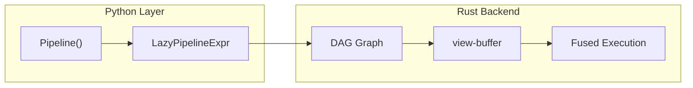

# polars-cv

**High-performance vision/array processing for Polars DataFrames.**

polars-cv is a Polars plugin that enables lazy, zero-copy image processing on DataFrame columns, powered by a Rust backend.

## Key Features

- **🚀 High Performance**: Rust-powered operations with automatic kernel fusion
- **🔗 Composable Pipelines**: DAG-based graph execution with CSE optimization
- **🎯 Multi-Domain**: Seamlessly move between images, masks, contours, and scalars
- **📊 Multi-Output**: Extract multiple intermediate results from one execution
- **🔌 ML Integration**: Direct output to NumPy, PyTorch, and other frameworks
- **☁️ Cloud Storage**: Read from S3, GCS, and Azure Blob Storage

## Quick Example

```python
import polars as pl
from polars_cv import Pipeline

# Define a reusable preprocessing pipeline
preprocess = (
    Pipeline()
    .source("image_bytes")
    .resize(height=224, width=224)
    .normalize(method="minmax")
    .sink("numpy")
)

# Apply to a DataFrame column
df = pl.DataFrame({"image": [image_bytes_1, image_bytes_2]})
result = df.with_columns(processed=pl.col("image").cv.pipeline(preprocess))
```

## Architecture



## Why polars-cv?

| Feature | polars-cv | Traditional Approach |
|---------|---------------|---------------------|
| **Execution** | Single fused pass | Multiple separate calls |
| **Memory** | Zero-copy where possible | Intermediate allocations |
| **Optimization** | Automatic CSE | Manual deduplication |
| **Typing** | Static domain inference | Runtime errors |
| **Cloud** | Native S3/GCS/Azure | Requires separate libraries |

## Getting Started

1. [Installation](getting-started/installation.md) - Install the package
2. [Quickstart](getting-started/quickstart.md) - Your first pipeline
3. [User Guide](user-guide/concepts/pipelines.md) - Deep dive into concepts

## API Reference

- [Pipeline](api/pipeline.md) - Pipeline builder class
- [LazyPipelineExpr](api/lazy.md) - Lazy composition
- [Geometry](api/geometry.md) - Contour operations
- [Functions](api/functions.md) - Utility functions

