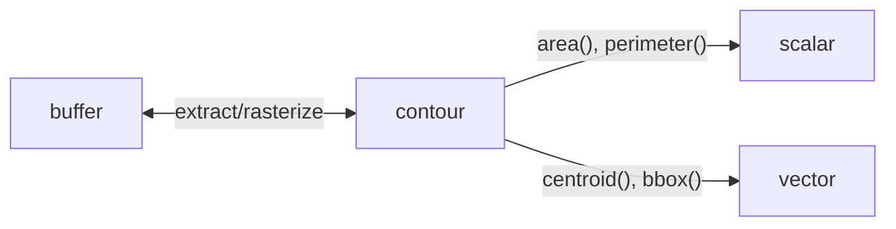

# Domains

polars-cv supports **multi-domain pipelines** that seamlessly transition between different data types.

## Domain Types

| Domain | Description | Example Data |
|--------|-------------|--------------|
| `buffer` | Image/array data | Pixels, tensors |
| `contour` | Polygon geometry | Extracted shapes |
| `scalar` | Single number | Area, perimeter |
| `vector` | Multiple numbers | Centroid (x, y) |

## Domain Transitions



### Buffer → Contour

Extract contours from a binary mask:

```python
# Create binary mask
mask_pipe = (
    Pipeline()
    .source("image_bytes")
    .grayscale()
    .threshold(128)
)

# Extract contours (future feature)
# contour_pipe = mask_pipe.extract_contours()
```

### Contour → Buffer

Rasterize contours to a mask:

```python
from polars_cv import Pipeline, CONTOUR_SCHEMA

# Contour source rasterizes to buffer
pipe = Pipeline().source("contour", width=200, height=200).sink("numpy")

df = pl.DataFrame({"contour": [contour_data]}).cast({"contour": CONTOUR_SCHEMA})
result = df.with_columns(mask=pl.col("contour").cv.pipeline(pipe))
```

### Contour → Scalar

Compute geometric measurements:

```python
import polars as pl

# Using the .contour namespace
result = df.with_columns(
    area=pl.col("contour").contour.area(),
    perimeter=pl.col("contour").contour.perimeter(),
    is_convex=pl.col("contour").contour.is_convex(),
)
```

### Contour → Vector

Compute multi-value results:

```python
# Centroid returns {x: f64, y: f64}
result = df.with_columns(
    centroid=pl.col("contour").contour.centroid(),
)

# Bounding box returns {x: f64, y: f64, width: f64, height: f64}
result = df.with_columns(
    bbox=pl.col("contour").contour.bounding_box(),
)
```

## Contour Operations

### Measurements

```python
# Area (signed or unsigned)
df.with_columns(area=pl.col("contour").contour.area())
df.with_columns(signed_area=pl.col("contour").contour.area(signed=True))

# Perimeter
df.with_columns(perimeter=pl.col("contour").contour.perimeter())

# Winding direction ("cw" or "ccw")
df.with_columns(winding=pl.col("contour").contour.winding())
```

### Predicates

```python
# Is the contour convex?
df.with_columns(convex=pl.col("contour").contour.is_convex())

# Does the contour contain a point?
df.with_columns(
    contains=pl.col("contour").contour.contains_point(pl.col("point"))
)
```

### Pairwise Operations

```python
# Intersection over Union
df.with_columns(
    iou=pl.col("contour_a").contour.iou(pl.col("contour_b"))
)

# Dice coefficient
df.with_columns(
    dice=pl.col("contour_a").contour.dice(pl.col("contour_b"))
)

# Hausdorff distance
df.with_columns(
    hausdorff=pl.col("contour_a").contour.hausdorff(pl.col("contour_b"))
)
```

### Transforms

```python
# Translate
df.with_columns(
    moved=pl.col("contour").contour.translate(dx=10, dy=20)
)

# Scale
df.with_columns(
    scaled=pl.col("contour").contour.scale(sx=2.0, sy=2.0)
)

# Simplify (Douglas-Peucker)
df.with_columns(
    simple=pl.col("contour").contour.simplify(tolerance=1.0)
)

# Convex hull
df.with_columns(
    hull=pl.col("contour").contour.convex_hull()
)
```

## Contour Schema

Contours are stored as Polars Struct columns with a specific schema:

```python
from polars_cv import CONTOUR_SCHEMA, POINT_SCHEMA

# POINT_SCHEMA: Struct({x: Float64, y: Float64})
# CONTOUR_SCHEMA: Struct({
#     exterior: List(POINT_SCHEMA),
#     holes: List(List(POINT_SCHEMA)),
#     is_closed: Boolean
# })
```

### Creating Contours

```python
from polars_cv.geometry.schemas import contour_from_points

# From a list of points
contour = contour_from_points([
    (10, 10), (10, 90), (90, 90), (90, 10)
])

df = pl.DataFrame({"contour": [contour]}).cast({"contour": CONTOUR_SCHEMA})
```

## Type Inference

polars-cv performs **static type inference** at Polars planning time:

```python
# The sink format determines the output dtype
pipe = Pipeline().source("image_bytes").grayscale().sink("png")
# Output: Binary

pipe = Pipeline().source("image_bytes").normalize().sink("list")
# Output: List[Float32]  (normalize promotes to float)

pipe = Pipeline().source("contour", width=100, height=100).sink("native")
# Error: buffer domain requires explicit format
```

## Next Steps

- [Geometry Operations](../operations/geometry.md) - All geometry operations
- [ML Integration](../ml-integration.md) - Using domains in ML workflows

